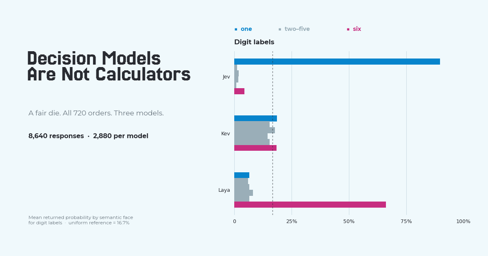
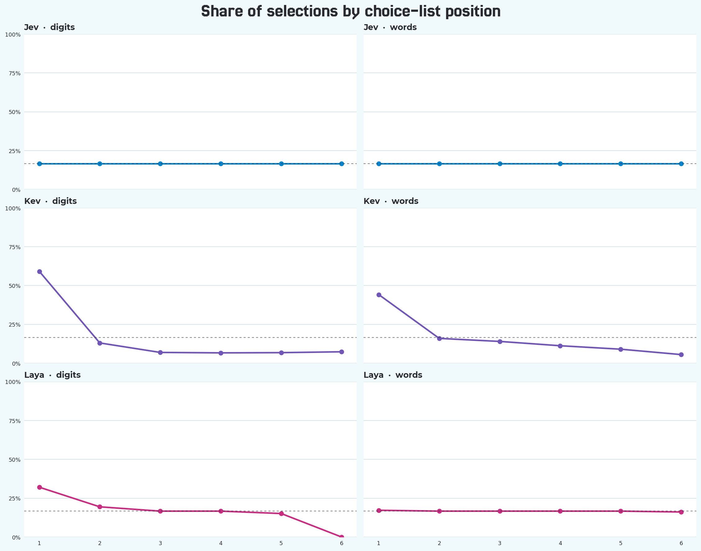

# Decision Models Are Not Calculators

> “Jev predicts that a dice roll has 81% probability of rolling a 1, with
> 77% confidence. That doesn't seem very calibrated to me.”

Jev is a *decision model*: an AI system that selects an answer from a supplied
list and reports a probability for each option. The reaction is
understandable. On a fair six-sided die, each face has a one-in-six chance—about
16.7%. The screen in that example showed **81% beside one** and a separate
**77% confidence** value. Jev was scoring the choices in a prompt; it was not
measuring the die or changing its odds. A single response cannot establish
whether the model is calibrated. But why did it favor one so strongly over the
other faces?

Anthus AI called Benford's Law “the obvious answer” to Jev's preference for
one. That was too certain. It was a hypothesis worth testing, not an
explanation we had established.

## The hypothesis

Benford's Law describes the leading digits of certain observed numerical
datasets: one appears more often than the other digits. That suggested a
possibility, not a rule for AI: if such numerical patterns are common in a
model's training data, perhaps the model will favor `1` when it must choose
among die faces without evidence about the result. Our earlier article,
[The Dominance of Ones](https://anth.us/blog/the-dominance-of-ones/), inspired
that possibility.

The hypothesis was about a *model's prediction*, not about the die. We could
test whether the models favored one; we could not inspect their training data
or prove why they did so.

## A preliminary result: Jev picks one

The state said, "A fair six-sided die was rolled once. The result is unknown."
The question asked, "Which face showed on the roll?" The alternatives were the
six marked faces. Unlike the motivating screenshot, which asked about a
future roll, our test asked about a completed roll with an unknown result.
Both prompts give the model no evidence favoring any face. Here is one
[actual digit-labelled request](results/examples.json) with the faces in
ordinary numerical order, sent to Jev:

```json
{
  "model": "jev-latest",
  "state": "A fair six-sided die was rolled once. The result is unknown.",
  "questions": {
    "die_result": {
      "type": "choice",
      "instructions": "Which face showed on the roll?",
      "criteria": {
        "1": "the die face marked 1",
        "2": "the die face marked 2",
        "3": "the die face marked 3",
        "4": "the die face marked 4",
        "5": "the die face marked 5",
        "6": "the die face marked 6"
      }
    }
  }
}
```

Jev selected `1` and returned these choice probabilities for that request:

| Face | 1 | 2 | 3 | 4 | 5 | 6 |
| --- | ---: | ---: | ---: | ---: | ---: | ---: |
| Jev's reported probability | .88 | .01 | .02 | .05 | .01 | .03 |

The public screenshot put 81% beside one; our different, recorded prompt put
88% there. Looked at alone, each result seems consistent with the idea that
Jev favors one. But in both examples, **one was the first choice listed**.
Neither example can tell us whether Jev favors the face marked `1` or just
the first option in a list. Our recorded request was one member of the full
test matrix, not a separate pilot experiment.

## Investigating the choice order

The replies to the original post raised this alternative: perhaps Jev was
favoring the *first slot*, not the *numeral one*. A quick reversal reportedly
made no difference, but that still left most possible arrangements untested.
If the numeral is what matters, the preference should follow `1` as it moves
through the list. If position matters, the preferred face should change when
we reorder the options.

Six alternatives have **720 possible orders**. We tested all 720 with digit
labels (`1` through `6`), then all 720 with word labels (`one` through `six`),
and repeated both sets. Every face appeared at every list position exactly
120 times per label form and pass. The [preregistered protocol](docs/PREREGISTERED.md)
fixed that matrix before the runs.

Jev chose face one in **all 2,880 requests**. In every digit-labelled request,
one had the unique highest returned probability. It was selected 120 times
from each of the six list positions in each digit pass, and it remained the
choice in every word-labelled request. Across the first digit pass, Jev's
mean reported P(1) was **89.7%**, versus **4.4%** for face six.

That result survived a systematic order check. It is consistent with the
Benford-inspired hypothesis, but it does **not** establish that Benford's
Law—or the frequency of any token in Jev's training data—caused it.

## Then we tried the other models

Jev's result made the hypothesis feel promising. Would the preference for one
show up in other decision models? Kev and Laya received the same state,
question, and alternatives. The request envelope differed only in its model
field: `"kev-latest"` for Kev and
`"english"` for Laya. Their responses to the exact digit order shown above
already looked different:

| Model | Selected face | P(1) | P(2) | P(3) | P(4) | P(5) | P(6) |
| --- | ---: | ---: | ---: | ---: | ---: | ---: | ---: |
| Jev | 1 | .88 | .01 | .02 | .05 | .01 | .03 |
| Kev | 6 | .1734 | .1172 | .1687 | .1623 | .1809 | .1975 |
| Laya | 1 | .3988 | .2483 | .1496 | .0723 | .0531 | .0780 |

These are actual selected choices and reported choice probabilities, not
calibrated probabilities that a guess is correct. The
[example file](results/examples.json) preserves the complete, unedited
request and response envelopes. Notice that Laya chose one in this *single*
order. We needed the whole matrix to see its usual behavior.

All three models received the 720 digit orders and 720 word orders twice:
**8,640 valid responses** in total. The [release manifest](results/release-manifest.json)
confirms that every planned request returned a valid response. The models
never observed a roll. The [released summary](results/summary.json) gives
the full contrast:

| Model | Face 1 selected, all 2,880 replies | Face 6 selected, all 2,880 replies | Mean P(1), digit pass 1 | Mean P(6), digit pass 1 |
| --- | ---: | ---: | ---: | ---: |
| Jev | 2,880 (100%) | 0 | 89.7% | 4.4% |
| Kev | 1,410 (49.0%) | 294 | 18.6% | 18.4% |
| Laya | 40 | 2,610 (90.6%) | 6.5% | 66.2% |

Kev did have a preference for one in its *selected answers*: 1,410 of 2,880
(49.0%). But it did not behave like Jev. In the first pass, Kev selected one
in 219 digit-labelled orders and 486 word-labelled orders; its mean digit
probabilities were comparatively close to the one-in-six baseline. A fairly
flat *average* probability distribution does not guarantee evenly distributed
selections: each selection is made from one particular response.

Laya was the real reversal. It selected **six in 2,610 of 2,880 replies**
(90.6%). In the first pass, that was 589 digit-labelled orders and 716
word-labelled orders. Its mean reported P(six) with word labels was **91.8%**.
So the Jev pattern was not a general rule for these decision models.



The [detailed face-probability chart](images/decision-models-face-probabilities.png)
separates digits from words. We grouped probabilities by the *face* named in
the alternative, not by where that alternative sat in the list. Its dashed
line is the known one-in-six baseline for an unseen fair roll; it is not a
probability measured by any of the models.

## Ordering mattered for Kev and Laya

The order of alternatives changed the pattern for Kev and Laya. In the first
digit pass, Kev selected the **first-listed choice 426 of 720 times** (59.2%),
even though each face spent exactly 120 of those orders in first position.
Laya selected the **last-listed choice zero times** in that pass. Jev, by
contrast, kept choosing face one wherever it appeared.



Changing the labels from digits to words, while keeping the corresponding
order, changed the selected face in **324 of 720 paired orders for Kev** and
**129 of 720 for Laya** in the first pass. It changed none of Jev's choices.
On exact repeats, all three models selected the same face for every matching
request. Kev's and Laya's returned probabilities were identical on repeat;
Jev's moved slightly without changing its choice. These are repeated model
responses, not independent observations of die rolls. Choice order and label
form plainly matter for Kev and Laya, but these tests do not tell us why each
model behaves as it does.

## What can we conclude?

The prompt described a fair, unseen die. Its faces each had a one-in-six
chance in that scenario; the returned numbers describe the models' responses
to our prompt, not the outcome of the roll. **Benford's Law might help explain
Jev's distribution of predictions.** We did not examine the training corpora, count
leading digits or numeral tokens in them, or change training data to find
out. Even for Jev, we observed a pattern consistent with the hypothesis, not
its cause.

Kev's partial preference for one and Laya's strong preference for six do not
fit the Jev pattern. Choice order and spelling affect their responses, but
we cannot say from this experiment what produced either distribution. We can
reject the sweeping claim that these decision models always predict one.
Beyond that, we cannot explain why the three models gave such different
answers.

## Reproduce and inspect the study

The [full summary](results/summary.json), [example requests and responses](results/examples.json),
and [checksummed release manifest](results/release-manifest.json) are public.
The complete answer archives are available for [Jev](data/answers/jev-responses.jsonl.gz),
[Kev](data/answers/kev-responses.jsonl.gz), and
[Laya](data/answers/laya-responses.jsonl.gz). The frozen study design is in
[`docs/PREREGISTERED.md`](docs/PREREGISTERED.md); [release notes and limitations](results/README.md),
[engine build notes](docs/engines.md), and the [measurement note](docs/measurement-notes.md)
document what was run and how Jev's rounded probabilities were handled.

Python 3.12 or newer is required. The core harness and replay need only the
standard library; engines and plots have separate optional dependencies. The
commands below are for reproducing or extending the released study; reading
the archives and regenerating the summary makes no model calls.

```sh
python -m venv .venv
. .venv/bin/activate
python -m pip install -e '.[test]'
pytest
decision-models plan
```

Set up one engine at a time using its pinned build notes. Credentials must be
provided through the process environment and must never be committed.

```sh
python -m pip install -e '.[jev]'
TYPESAFE_API_KEY=... decision-models run --engine jev
decision-models summarize --engine jev
```

Run the registered Kev service on loopback as documented in
[`docs/engines.md`](docs/engines.md), then:

```sh
KEV_BASE_URL=http://127.0.0.1:8009 decision-models run --engine kev
```

Laya runs locally. Install the pinned package and use the exact checkpoint
revision documented in [`docs/engines.md`](docs/engines.md):

```sh
python -m pip install -e '.[laya]'
export LAYA_CHECKPOINT_PATH=/path/to/55cf4c4ebb4ebe31b2550e8bdf3bd21b99753851
decision-models run --engine laya
```

The runner checkpoints each response. Re-running skips completed request IDs
and retries the first failed or unattempted request. It stops at the first
error to avoid repeating a systemic failure across thousands of calls. Results
are accepted only when the expected model identity and response shape are
present. Raw local records are written to `data/answers/<engine>.jsonl`; clean,
complete, checksummed replay archives are exported by the `release` command.

```sh
decision-models summarize --engine all
python -m pip install -e '.[charts]'
decision-models charts
```

### Regenerate the published results

The complete release was created with `decision-models release` and
`decision-models charts`. Both commands require all three complete engines
unless an explicitly labelled interim release is requested with
`--allow-incomplete`. See
[`results/README.md`](results/README.md).
The summary code makes no model calls. It verifies complete permutation
coverage and regenerates the article data from the raw answer record.

## License

This repository's harness is [MIT-licensed](LICENSE). Model code, weights, and
services retain their authors' terms; see the [build notes](docs/engines.md)
before running an engine.
