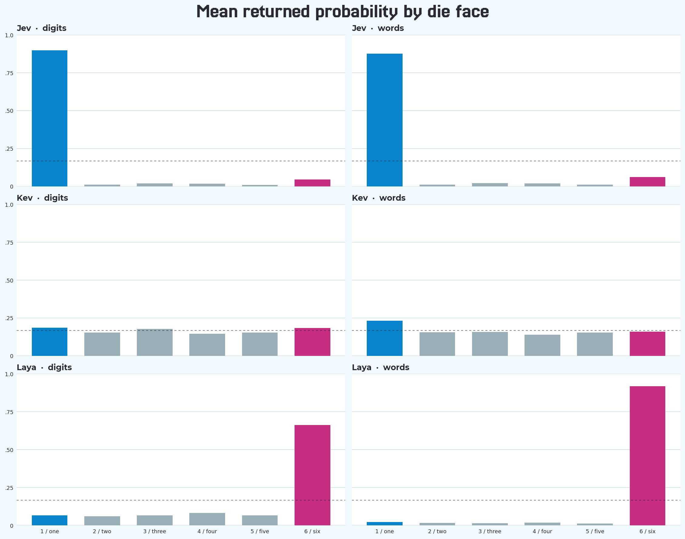

# Decision Models Are Not Calculators

Someone rolls a fair six-sided die where nobody can see it. We know it landed
on a face, but not which one. Each face still has a one-in-six chance. What
happens if we ask a decision model to name the face anyway?

We asked three. **Jev chose one every time. Kev chose one about half the time.
Laya mostly chose six.** The models returned well-formed answers and
probabilities, but they had no information about the roll. This is a study of
their responses to a question, not a way to discover what happened behind the
screen.


The question grew out of [The Dominance of Ones](https://anth.us/blog/the-dominance-of-ones/),
an article about Benford's Law. In many numerical datasets, one appears as a
*leading digit* more often than the other digits. Could a related imbalance in
training data make a model favor one when it has to choose a die face? That is
an interesting hypothesis. The three models give us a useful test of the
prediction, but not a test of its proposed cause.

## One roll, three answers

The state said, "A fair six-sided die was rolled once. The result is unknown."
The question asked, "Which face showed on the roll?" The alternatives were the
six marked faces. Here is one [actual digit-labelled request](results/examples.json),
shown with Jev's model identifier. Kev received the same envelope with
`"model": "kev-latest"`; Laya's field was `"model": "english"`.

```json
{
  "model": "jev-latest",
  "state": "A fair six-sided die was rolled once. The result is unknown.",
  "questions": {
    "die_result": {
      "type": "choice",
      "instructions": "Which face showed on the roll?",
      "criteria": {
        "1": "the die face marked 1",
        "2": "the die face marked 2",
        "3": "the die face marked 3",
        "4": "the die face marked 4",
        "5": "the die face marked 5",
        "6": "the die face marked 6"
      }
    }
  }
}
```

For that exact order, these are the selected choices and returned per-face
probabilities. The [example file](results/examples.json) retains the complete,
unedited request and response envelopes. These are the models' reported choice
probabilities, not calibrated probabilities that a guess is correct.

| Model | Selected face | P(1) | P(2) | P(3) | P(4) | P(5) | P(6) |
| --- | ---: | ---: | ---: | ---: | ---: | ---: | ---: |
| Jev | 1 | .88 | .01 | .02 | .05 | .01 | .03 |
| Kev | 6 | .1734 | .1172 | .1687 | .1623 | .1809 | .1975 |
| Laya | 1 | .3988 | .2483 | .1496 | .0723 | .0531 | .0780 |

Laya chose one in this example, yet six was its overwhelming favorite across
the full experiment. One screenshot of one response would have told the wrong
story.

## Every order of the choices

Six alternatives have **720 possible orders**. We tested every order with
digit labels (`1` through `6`), then with word labels (`one` through `six`),
and repeated both sets. That made 2,880 requests per model and **8,640 valid
responses** in all. The [preregistered protocol](docs/PREREGISTERED.md) fixed
the matrix before the runs. Within each label form and pass, every face
appeared at every list position exactly 120 times.

The [released summary](results/summary.json) gives the main result:

| Model | Face 1 selected, all 2,880 replies | Face 6 selected, all 2,880 replies | Mean P(1), digit pass 1 | Mean P(6), digit pass 1 |
| --- | ---: | ---: | ---: | ---: |
| Jev | 2,880 (100%) | 0 | 89.7% | 4.4% |
| Kev | 1,410 (49.0%) | 294 | 18.6% | 18.4% |
| Laya | 40 | 2,610 (90.6%) | 6.5% | 66.2% |

Jev made one the unique highest-probability face in every digit-labelled
request, as well as selecting it in every word-labelled request. Kev's mean
digit probabilities were comparatively close to the fair-die baseline of
16.7% per face, although its *selected answers* still favored one. In the
first pass, Kev selected one in 219 digit-labelled orders and 486 word-labelled
orders. A fairly flat average probability distribution does not guarantee
evenly distributed selections: each selection is made from the probabilities
for one particular order. Laya strongly favored six, selecting it in 589
digit-labelled and 716 word-labelled orders in the first pass. Its mean
P(six) with word labels was **91.8%**. The literal "always one" prediction held
for Jev and failed for Kev and Laya.



We grouped probabilities by the *face* named in the alternative, not by where
that alternative sat in the list. Moving `six` from first to last did not
change which face its probability belonged to. The dashed line is the known
one-in-six baseline for an unseen fair roll; it is not a probability measured
by any of the models.

## The list has a gravity of its own

The order of alternatives changed the pattern for Kev and Laya. In the first
digit pass, Kev selected the **first-listed choice 426 of 720 times** (59.2%),
even though each face spent exactly 120 of those orders in first position.
Laya selected the **last-listed choice zero times** in that pass. Jev always
selected face one, wherever it appeared, so its selected positions were
evenly split: 120 at each of the six positions.


Changing the labels from digits to words, while keeping the corresponding
order, changed the selected face in **324 of 720 paired orders for Kev** and
**129 of 720 for Laya** in the first pass. It changed none of Jev's choices.
On exact repeats, all three models selected the same face for every matching
request. Kev's and Laya's returned probabilities were identical on repeat;
Jev's moved slightly without changing its choice. These are repeated model
responses, not independent observations of die rolls.

## What Benford's Law can—and cannot—explain

Jev's result is compatible with the original intuition: it acts as though one
has a strong prior even when the question supplies no evidence favoring that
face. But **compatibility is not causation**. We did not inspect the models'
training corpora, count their numeral tokens, or vary the training data. We
cannot attribute Jev's behavior to Benford's Law, nor can we say why Kev and
Laya returned different patterns. The three outcomes do rule out the broad
claim that decision models *always* predict one in this setup.

Benford's Law describes the leading-digit distribution of certain observed
numerical datasets. It does not say a fair die lands on one more often, and it
does not by itself tell us how often a model saw the token `1`. The known
probability of each unseen die face remains one in six. A model's choice
probabilities describe its response to the prompt, not evidence about the
hidden roll.

If your application needs a fair die, use a random-number generator. If it
needs a model to compare options, test the model on the decision distribution
you care about. Rotate the alternatives, try equivalent labels, retain the
returned probabilities, and pin the build. A structured response can be
perfectly valid while carrying a preference you never intended to ask for.

## Reproduce and inspect the study

The [full summary](results/summary.json), [example requests and responses](results/examples.json),
and [checksummed release manifest](results/release-manifest.json) are public.
The complete answer archives are available for [Jev](data/answers/jev-responses.jsonl.gz),
[Kev](data/answers/kev-responses.jsonl.gz), and
[Laya](data/answers/laya-responses.jsonl.gz). The frozen study design is in
[`docs/PREREGISTERED.md`](docs/PREREGISTERED.md); [release notes and limitations](results/README.md),
[engine build notes](docs/engines.md), and the [measurement note](docs/measurement-notes.md)
document what was run and how Jev's rounded probabilities were handled.

Python 3.12 or newer is required. The core harness and replay need only the
standard library; engines and plots have separate optional dependencies. The
commands below are for reproducing or extending the released study; reading
the archives and regenerating the summary makes no model calls.

```sh
python -m venv .venv
. .venv/bin/activate
python -m pip install -e '.[test]'
pytest
decision-models plan
```

Set up one engine at a time using its pinned build notes. Credentials must be
provided through the process environment and must never be committed.

```sh
python -m pip install -e '.[jev]'
TYPESAFE_API_KEY=... decision-models run --engine jev
decision-models summarize --engine jev
```

Run the registered Kev service on loopback as documented in
[`docs/engines.md`](docs/engines.md), then:

```sh
KEV_BASE_URL=http://127.0.0.1:8009 decision-models run --engine kev
```

Laya runs locally. Install the pinned package and use the exact checkpoint
revision documented in [`docs/engines.md`](docs/engines.md):

```sh
python -m pip install -e '.[laya]'
export LAYA_CHECKPOINT_PATH=/path/to/55cf4c4ebb4ebe31b2550e8bdf3bd21b99753851
decision-models run --engine laya
```

The runner checkpoints each response. Re-running skips completed request IDs
and retries the first failed or unattempted request. It stops at the first
error to avoid repeating a systemic failure across thousands of calls. Results
are accepted only when the expected model identity and response shape are
present. Raw local records are written to `data/answers/<engine>.jsonl`; clean,
complete, checksummed replay archives are exported by the `release` command.

```sh
decision-models summarize --engine all
python -m pip install -e '.[charts]'
decision-models charts
```

### Regenerate the published results

The complete release was created with `decision-models release` and
`decision-models charts`. Both commands require all three complete engines
unless an explicitly labelled interim release is requested with
`--allow-incomplete`. See
[`results/README.md`](results/README.md).
The summary code makes no model calls. It verifies complete permutation
coverage and regenerates the article data from the raw answer record.

## License

This repository's harness is [MIT-licensed](LICENSE). Model code, weights, and
services retain their authors' terms; see the [build notes](docs/engines.md)
before running an engine.
